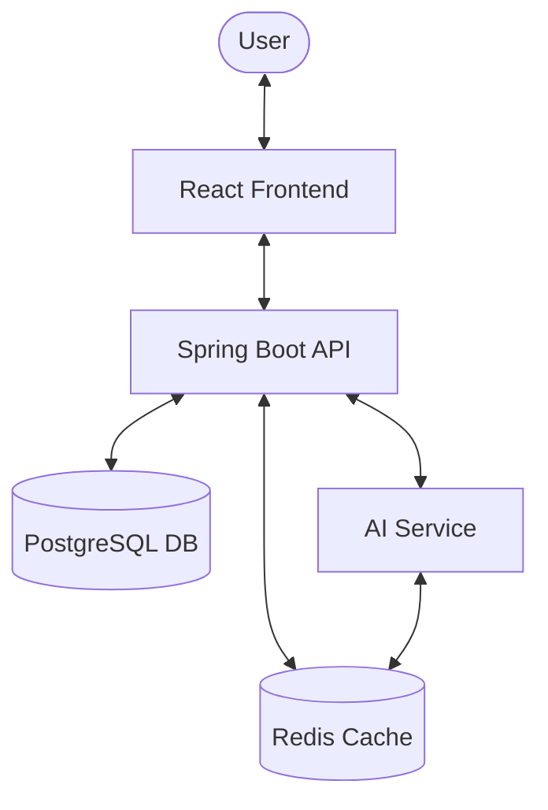

# 📊 AI-Powered Data Flow Diagram Builder


## 🚀 Overview

The **AI-Powered Data Flow Diagram (DFD) Builder** is a robust full-stack solution designed to streamline the creation and analysis of system architectures. By integrating intelligent AI services, it provides real-time feedback, automated descriptions, and optimization suggestions for complex data flows.

### ✨ Key Features
- **Interactive DFD Canvas**: Advanced UI for designing multi-level data flow diagrams.
- **AI Analysis Engine**: Leveraging LLMs to describe flows and recommend architectural improvements.
- **Enterprise-Grade Security**: JWT-based authentication with role-based access control (RBAC).
- **Automated Reporting**: Generate comprehensive PDF/JSON reports based on diagram analysis.
- **Intelligent Caching**: Redis integration for sub-second response times on repetitive AI queries.
- **Scalable Infrastructure**: Fully containerized using Docker for seamless deployment.

---

## 🏗️ System Architecture

The application follows a distributed architecture, ensuring high availability and separation of concerns.



### 🛰️ Service Breakdown:
- **Frontend (React 19)**: Responsive SPA using Vite, Tailwind CSS, and Recharts.
- **Backend (Spring Boot 3.4)**: RESTful API managing business logic, persistence, and JWT security.
- **AI Service (Python)**: Specialized service for NLP tasks and architectural analysis.
- **Database (PostgreSQL 15)**: Reliable storage for user profiles and diagram state.
- **Caching (Redis 7)**: Optimized for fast retrieval of AI-generated insights.

---

## 🛠️ Technology Stack

| Layer | Technology |
| :--- | :--- |
| **Frontend** | React 19, Vite, Tailwind CSS, Axios |
| **Backend** | Spring Boot 3.4, Spring Security, JPA/Hibernate |
| **AI/ML** | Python 3.11, Flask/FastAPI, Sentence-Transformers |
| **Storage** | PostgreSQL 15, Redis 7 |
| **DevOps** | Docker, Docker Compose, JaCoCo (Coverage) |

---

## 📋 Prerequisites

Ensure you have the following installed on your machine:
- **Docker & Docker Compose** (Desktop or Server)
- **Node.js 18+** (for local UI development)
- **JDK 17+** (for local API development)
- **Python 3.10+** (for local AI development)

---

## ⚙️ Setup & Installation

### 1. Clone the Repository
```bash
git clone https://github.com/ganeshkolare5-blip/data-flow-diagram-builder.git
cd data-flow-diagram-builder
```

### 2. Docker Deployment (Recommended)
Launch the entire stack with a single command:

```bash
docker-compose up --build
```

**Access Points:**
- 🖥️ **Frontend**: [http://localhost:5173](http://localhost:5173)
- ⚙️ **Backend API**: [http://localhost:8080](http://localhost:8080)
- 🤖 **AI Service**: [http://localhost:5000](http://localhost:5000)
- 📝 **Swagger Docs**: `http://localhost:8080/swagger-ui/index.html`

### 3. Manual Development Setup

#### Backend:
```bash
cd Backend/tool
./mvnw spring-boot:run
```

#### Frontend:
```bash
cd frontend
npm install
npm run dev
```

#### AI Service:
```bash
cd ai-service
pip install -r requirements.txt
python app.py
```

---

## 🔐 Environment Reference Table

| Variable | Purpose | Default Value |
| :--- | :--- | :--- |
| `DB_URL` | PostgreSQL connection string | `jdbc:postgresql://db:5432/dfd_builder` |
| `DB_USERNAME` | Database admin user | `postgres` |
| `DB_PASSWORD` | Database admin password | `Ganesh@24` |
| `REDIS_HOST` | Redis endpoint | `redis` |
| `REDIS_PORT` | Redis communication port | `6379` |
| `JWT_SECRET` | 256-bit key for token signing | `404E635266556...` |
| `MAIL_HOST` | SMTP server for notifications | `smtp.gmail.com` |
| `MAIL_USERNAME` | Outbound email address | `example@gmail.com` |
| `MODEL_NAME` | AI model used for analysis | `all-MiniLM-L6-v2` |

---

## 🧪 Quality & Testing
We maintain high standards through automated testing and coverage analysis.

**Backend Coverage:**
```bash
cd Backend/tool
./mvnw test
# View report: target/site/jacoco/index.html
```

---

## 📄 License
Distributed under the MIT License. See `LICENSE` for more information.

## 👤 Author
**Ganesh** - *Full Stack Developer*
